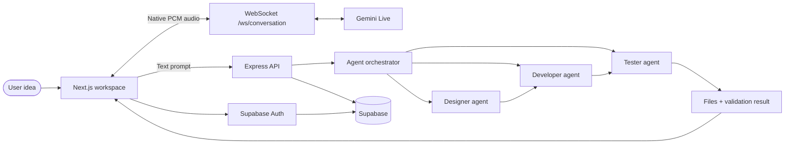

# Vibe

> **Code in your Mother Tongue.**

Vibe is an AI-powered website creation workspace that turns a natural-language idea into a working website. It combines a Next.js frontend, an Express backend, Supabase authentication and persistence, and a team of AI agents that collaborate on design, development, and testing.

The goal is simple: describe what you want, talk to the agents in real time, inspect the generated code, preview the result, and keep ownership of every file.

<p align="center">
  
  
  
  
  
</p>

## Product vision

Vibe is being built for people who have a product idea but do not want a blank editor or a complicated setup to stand between the idea and a working prototype.

The workspace is designed around one creative loop:

1. **Describe** an idea with text or voice.
2. **Understand** the intent using the multi-agent workflow.
3. **Design** the experience and visual direction.
4. **Develop** the website files.
5. **Test** the generated output and report issues.
6. **Iterate** in the editor and live preview.
7. **Own and ship** the resulting project.

## How it works



### Agent workflow

- **Designer agent** turns a prompt into a visual and interaction plan.
- **Developer agent** generates or updates the project files.
- **Tester agent** checks the generated result and returns errors, warnings, and suggestions.
- The workspace keeps the agent events, generated files, and validation state visible so the user can review the work instead of receiving an opaque answer.

### Real-time voice

The voice workspace uses a persistent WebSocket at:

```text
ws://localhost:4000/ws/conversation
```

The browser captures microphone audio as PCM, the backend proxies the stream to Gemini Live, and the returned PCM audio is played back in the browser. This is a native audio-to-audio path with interruption support (barge-in); it is not a simulated REST conversation.

Groq Whisper and Sarvam voice services are available for non-live/legacy transcription and synthesis flows. They are not used to fake the native Gemini Live audio session.

## Current features

- AI-assisted website generation
- Designer, Developer, and Tester agent workflow
- Native real-time audio-to-audio conversation
- Barge-in/interruption handling during voice sessions
- Monaco code editor
- Live preview of generated files
- Supabase email/password authentication
- Supabase-backed profiles and project data
- GitHub integration foundation
- Agent status and workflow event tracking
- Responsive landing page and application workspace

## Tech stack

| Layer | Technologies |
| --- | --- |
| Frontend | Next.js 15, React 19, TypeScript, Tailwind CSS 4, Zustand |
| Editor | Monaco Editor |
| Backend | Node.js, Express 5, TypeScript, WebSocket (`ws`) |
| Authentication and database | Supabase Auth, PostgreSQL, Row Level Security |
| AI | Gemini Live, Gemini text generation, Groq |
| Voice integrations | Gemini Live, Sarvam, Groq Whisper |
| Integrations | Tavily, GitHub API/Octokit |

## Repository structure

```text
vibe/
├── frontend/
│   ├── app/                 # Next.js routes and screens
│   ├── components/          # Reusable UI and voice components
│   ├── hooks/               # WebSocket and client hooks
│   ├── lib/                 # Supabase and API clients
│   ├── store/               # Zustand application state
│   ├── types/               # Shared frontend types
│   └── public/              # Images and static assets
├── backend/
│   └── src/
│       ├── agents/          # Agent types and orchestration
│       ├── ai/              # Provider and code-generation logic
│       ├── config/          # Environment configuration
│       ├── controllers/     # HTTP request handlers
│       ├── routes/          # REST API routes
│       ├── services/        # AI, voice, and business services
│       ├── voice/           # Legacy voice integrations
│       └── websocket/       # WebSocket routing and sessions
├── database/
│   ├── migrations/          # SQL schema migrations
│   └── seed.sql             # Optional seed data
├── .env.example             # Safe environment template
└── package.json             # Root development scripts
```

## Getting started

### Prerequisites

- Node.js 20 or newer
- npm
- A Supabase project
- Gemini API access for native voice conversations
- Groq API access for agent/text workflows
- Optional: Tavily, Sarvam, and GitHub credentials

### Install

```bash
git clone https://github.com/amanyatan/BUILD-WITH-VEXITE-VIBE.git
cd vibe
npm install
npm install --prefix frontend
npm install --prefix backend
```

### Configure environment variables

Copy the template and fill in your own credentials:

```bash
copy .env.example .env
```

For the browser, create `frontend/.env.local` with the public values:

```dotenv
NEXT_PUBLIC_API_URL=http://localhost:4000/api
NEXT_PUBLIC_WS_URL=ws://localhost:4000/ws/conversation
NEXT_PUBLIC_SUPABASE_URL=https://your-project.supabase.co
NEXT_PUBLIC_SUPABASE_ANON_KEY=your-public-anon-key
```

For the backend, keep secret values in the root `.env` or `backend/.env`:

```dotenv
PORT=4000
NODE_ENV=development
FRONTEND_URL=http://localhost:3000

GEMINI_API_KEY=your-gemini-key
GEMINI_MODEL=gemini-2.0-flash
GEMINI_LIVE_MODEL=gemini-2.0-flash-live-preview
GROQ_API_KEY=your-groq-key
GROQ_MODEL=llama-3.3-70b-versatile
TAVILY_API_KEY=your-tavily-key
SARVAM_API_KEY=your-sarvam-key

SUPABASE_URL=https://your-project.supabase.co
SUPABASE_SERVICE_ROLE_KEY=your-server-only-service-role-key
GITHUB_CLIENT_ID=your-github-client-id
GITHUB_CLIENT_SECRET=your-github-client-secret
GITHUB_CALLBACK_URL=http://localhost:4000/api/github/callback
```

Never commit `.env`, `.env.local`, API keys, service-role keys, or access tokens. The service-role key must never be exposed through `NEXT_PUBLIC_*` variables.

### Set up Supabase

1. Create a Supabase project.
2. Enable the authentication provider you want to use.
3. Run the SQL migration in [`database/migrations/001_initial.sql`](database/migrations/001_initial.sql), or use the Supabase Auth-compatible profile/project schema provided by the application setup.
4. Add `http://localhost:3000/auth/callback` to the Supabase redirect URL allow list if email confirmation is enabled.

### Run both applications

From the repository root:

```bash
npm run dev
```

The services start at:

| Service | URL |
| --- | --- |
| Frontend | http://localhost:3000 |
| Backend API | http://localhost:4000 |
| Backend health | http://localhost:4000/health |
| Conversation WebSocket | ws://localhost:4000/ws/conversation |

Run them separately when needed:

```bash
npm run dev:frontend
npm run dev:backend
```

### Production build

```bash
npm run build
npm run start:backend
npm run start:frontend
```

## API and real-time endpoints

| Endpoint | Purpose |
| --- | --- |
| `GET /health` | Backend health check |
| `/api/auth/*` | Authentication-related API routes |
| `/api/projects/*` | Project operations |
| `/api/ai/*` | AI generation and agent operations |
| `/api/github/*` | GitHub integration |
| `WS /ws/conversation` | Native audio-to-audio Gemini Live session |

## Troubleshooting

### Port 3000 is already in use

Another Next.js process is running. Stop the existing process or run the frontend on a different port. Do not start `npm run dev` multiple times.

### Environment variables appear to be missing

- `.env.example` is only a template; it is not loaded automatically.
- Restart both development servers after changing environment files.
- Browser variables must use the `NEXT_PUBLIC_` prefix.
- Backend-only secrets such as `SUPABASE_SERVICE_ROLE_KEY` must stay server-side.

### The page has no CSS or stale Next.js assets

Stop the frontend server, remove the local Next cache, and restart it:

```bash
rmdir /s /q frontend\.next
npm run dev:frontend
```

## Security notes

- Rotate any credential that has been pasted into chat, screenshots, commits, or public repositories.
- Use Supabase Row Level Security so users can only access their own projects.
- Keep API keys on the backend wherever possible.
- Do not insert users directly into `auth.users`; use Supabase Auth sign-up methods.

## Project status

Vibe is an active product build. The core full-stack foundation, authentication flow, agent workflow, editor/preview experience, and real WebSocket voice path are implemented. Persistence wiring and product polish continue to evolve as the workspace becomes a complete AI website-building environment.

## License

MIT
